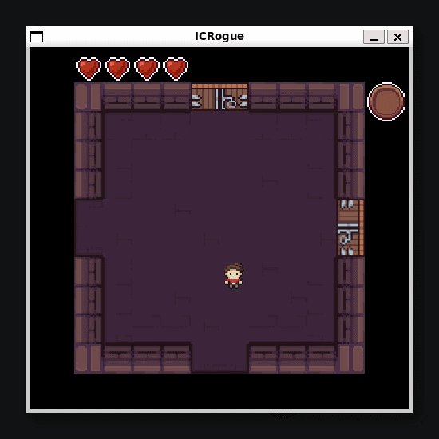
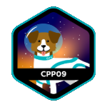
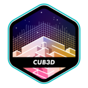
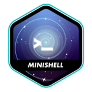

## Hi, I'm Natalino

  
  

 

After trying the "traditional path" (EPFL, HEIA)... I realized lectures and theory weren't my thing. So here I am at 42, learning programming the hard way: <strong>peer-to-peer, no teachers, just pure code</strong>.

### Key Projects

<table>
  <!--
  <tr>
    <td width="150" align="center">
      
    </td>
    <td>
      <strong>TODO</strong> 
      todo 
      <em>Tech: todo</em>
    </td>
  </tr>
  -->
  <tr>
    <td width="150" align="center">
      
    </td>
    <td>
      <strong>HTTP Server</strong> 
      Built a fully functional, non-blocking HTTP/1.0 server in C++98 with a partner, following a CONTRIBUTING.md (feature branches, conventional commits, mandatory PR reviews). Managed socket multiplexing (poll) and CGI execution. 
      <em>Tech: C++, Sockets, HTTP Protocol, Network</em>
    </td>
  </tr>
  <tr>
    <td width="150" align="center">
      
    </td>
    <td>
      <strong>Infrastructure & DevOps</strong> 
      Set up a complete corporate infrastructure using Docker. Built custom images for Nginx, WordPress, and MariaDB running in a dedicated Docker network. 
      <em>Tech: Docker, Docker-compose, Linux, Bash</em>
    </td>
  </tr>
  <tr>
    <td width="150" align="center">
      
    </td>
    <td>
      <strong>Roguelike Game Engine</strong> 
      Built a Java roguelike dungeon crawler on a 2D grid engine: procedural level generation, enemies, weapons, and an encapsulated OOP architecture. 
      <em>Tech: Java, OOP, Game Engine, Procedural Generation</em>
    </td>
  </tr>
  <!--
  <tr>
    <td width="150" align="center">
      
    </td>
    <td>
      <strong>Advanced STL & Algorithmics</strong> 
      Leveraged C++98 STL for relational data mapping (time-series analysis) and LIFO stack-based parsing. Implemented the Ford-Johnson sort to benchmark time complexity across sequence containers. 
      <em>Tech: C++, STL (Map, Stack, Vector), Time Complexity</em>
    </td>
  </tr>
  <tr>
    <td width="150" align="center">
      
    </td>
    <td>
      <strong>3D Raycasting Engine</strong> 
      Created a 3D first-person maze game inspired by Wolfenstein 3D. Handled rigorous map parsing and validation, alongside raycasting math and real-time rendering. 
      <em>Tech: C, Map Parsing, Raycasting, Mathematics</em>
    </td>
  </tr>
  -->
  <tr>
    <td width="150" align="center">
      
    </td>
    <td>
      <strong>UNIX Shell</strong> 
      Recreated a Bash-like shell from scratch. Built a custom lexer/parser (AST) to handle child processes, pipes, logical operators (&&, ||), subshells, and wildcards. 
      <em>Tech: C, AST, POSIX API, System Architecture</em>
    </td>
  </tr>
  <tr>
    <td width="150" align="center">
      
    </td>
    <td>
      <strong>Concurrency & Threads</strong> 
      Solved the dining philosophers problem. Managed concurrent threads and prevented data races and deadlocks using mutexes. 
      <em>Tech: C, Multithreading, Synchronization</em>
    </td>
  </tr>
  <tr>
    <td width="150" align="center">
      
    </td>
    <td>
      <strong>Image Codec (QOI format)</strong> 
      Built a byte-level encoder/decoder for the QOI lossless image format, working with bitwise operators, modular arithmetic, and hash tables. 
      <em>Tech: Java, Bitwise Operations, Hash Tables, OOP</em>
    </td>
  </tr>
</table>